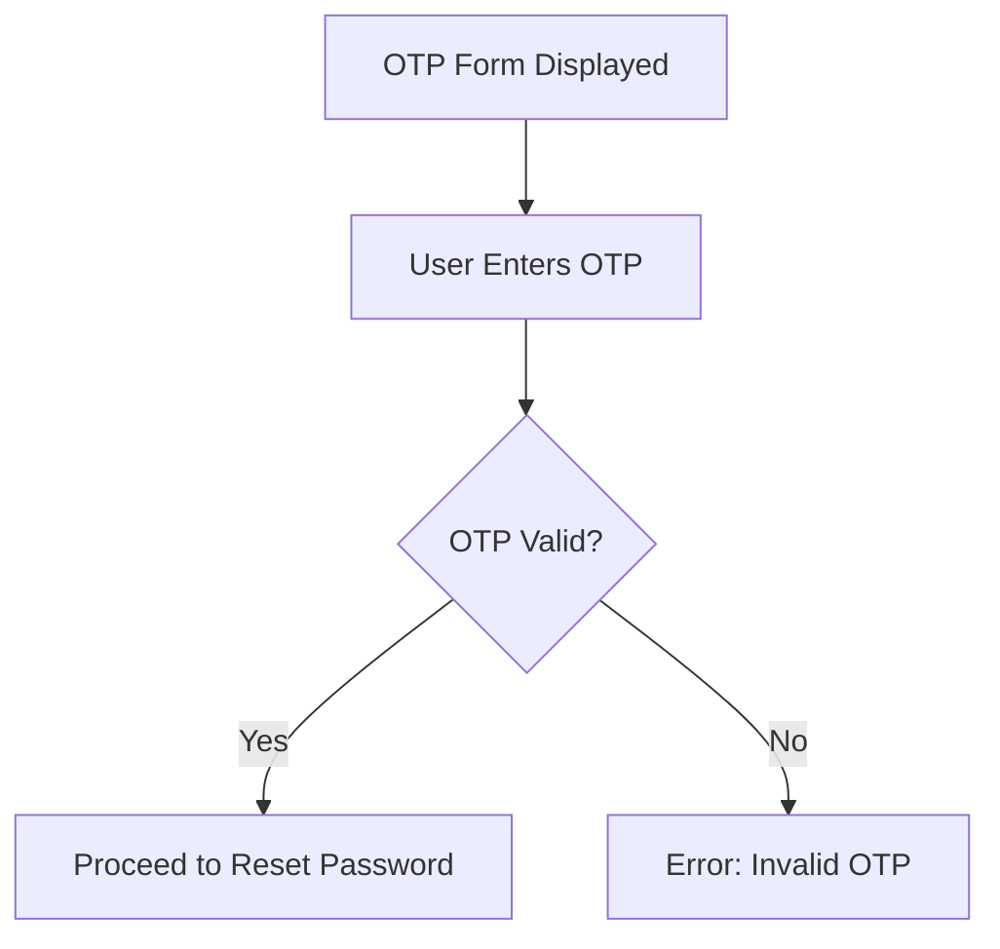
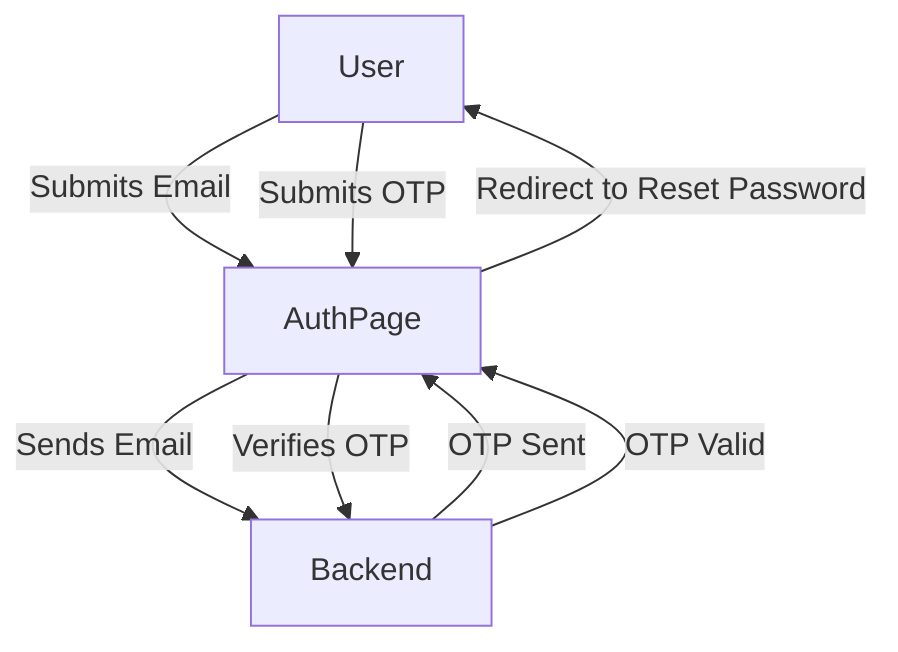

# OscuroBok Frontend Codebase

Welcome to the OscuroBok Frontend Codebase! This README provides a comprehensive yet simple guide for new contributors to understand the key components and flow of this Next.js project. The codebase primarily focuses on user authentication, OTP verification, and role-based access, using various modern technologies like React, Redux, MUI, Formik, and more.

## Tech Stack


- **Frontend**: Next.js, React, Redux
- **Styling**: Material-UI (MUI) components, custom styles
- **API Requests**: Axios (via services)
- **State Management**: Redux Toolkit
- **Form Handling**: Formik & Yup (for validation)
- **Authentication**: OTP-based (Simulated)

---

## Key Features

### Email-to-OTP Workflow
- Users enter their email, triggering an OTP form. The OTP is verified against the backend to initiate a password reset.

### Role-Based Routing
- Based on the user type (Admin/User), redirection occurs after login using a single API call.

### Smooth Transitions
- Components like email and OTP forms have smooth UI transitions for better user experience.

### Form Validation & Feedback
- Uses Formik to handle form state, and validation provides real-time feedback. Alerts are shown using `react-toastify`.

### Workflow Diagram



AuthForgotPassword Component
- Located in app/pages/auth/forgotPassword.tsx
- Handles email input and OTP verification using the useFormik hook for state management.

 State Management
- The Redux store manages global authentication and user data. Key actions include login, verifyOtp, and fetchUserData

### Project Flow


    

# OscuroBok_dashboard
* git init
* git clone https://github.com/OscuroBok/OscuroBok_dashboard.git(Clone from master)
* git clone -b dashboard-sign-in https://github.com/OscuroBok/OscuroBok_dashboard_FE.git((Clone from other branch)
* git add --all
* git commit -m "Some mesage"
* git push or git push --set-upstream origin master
* npm i
* npm run dev

# To push pull
* git branch -m main master
* git fetch origin
* git branch -u origin/master master
* git remote set-head origin -a
* git push


**Documentation built by Developers**

Each element is well presented in very complex documentation.

You can read more about the [documentation here](https://www.material-tailwind.com/docs/react/installation).

- Check [FAQ Page](https://www.creative-tim.com/faq)


## Table of Contents

- [Versions](#versions)
- [Demo](#demo)
- [Quick Start](#quick-start)
- [Deploy](#deploy)
- [Documentation](#documentation)
- [File Structure](#file-structure)
- [Browser Support](#browser-support)
- [Resources](#resources)
- [Reporting Issues](#reporting-issues)
- [Technical Support or Questions](#technical-support-or-questions)
- [Licensing](#licensing)
- [Useful Links](#useful-links)

## Versions

[](https://www.creative-tim.com/product/material-tailwind-dashboard-react?ref=readme-mtdr)

| React |
| ----- |

| [](http://demos.creative-tim.com/material-tailwind-dashboard-react/#/?ref=readme-mtdr)

## Demo

- [Dashboard page](https://demos.creative-tim.com/material-tailwind-dashboard-react/#/dashboard/home?ref=readme-mtdr)
- [Profile page](https://demos.creative-tim.com/material-tailwind-dashboard-react/#/dashboard/profile?ref=readme-mtdr)
- [Tables page](https://demos.creative-tim.com/material-tailwind-dashboard-react/#/dashboard/tables?ref=readme-mtdr)
- [Notifications page](https://demos.creative-tim.com/material-tailwind-dashboard-react/#/dashboard/notifications?ref=readme-mtdr)
- [Sign in page](https://demos.creative-tim.com/material-tailwind-dashboard-react/#/auth/sign-in?ref=readme-mtdr)
- [Sign up page](https://demos.creative-tim.com/material-tailwind-dashboard-react/#/auth/sign-up?ref=readme-mtdr)


## Deploy

:rocket: You can deploy your own version of the template to Genezio with one click:

[](https://app.genez.io/start/deploy?repository=https://github.com/creativetimofficial/material-tailwind-dashboard-react&utm_source=github&utm_medium=referral&utm_campaign=github-creativetim&utm_term=deploy-project&utm_content=button-head)

## Terminal Commands

1. Download and Install NodeJs LTS version from [NodeJs Official Page](https://nodejs.org/en/download/).
2. Navigate to the root ./ directory of the product and run `npm install` or `yarn install` or `pnpm install` to install our local dependencies.

## Documentation

The documentation for the Material Tailwind Dashboard React is hosted at our [website](https://material-tailwind.com/?ref=readme-mtdr).

### What's included

Within the download you'll find the following directories and files:

```
material-tailwind-dashboard-react
    ├── public
    │   ├── css
    │   └── img
    ├── src
    │   ├── configs
    │   ├── context
    │   ├── data
    │   ├── layouts
    │   ├── pages
    │   ├── widgets
    │   ├── App.jsx
    │   ├── main.jsx
    │   └── routes.jsx
    ├── .gitignore
    ├── CHANGELOG.md
    ├── index.html
    ├── ISSUE_TEMPLATE.md
    ├── jsconfig.json
    ├── LICENSE
    ├── package.json
    ├── postcsss.config.cjs
    ├── prettier.config.cjs
    ├── README.md
    ├── tailwind.config.cjs
    └── vite.config.js
```

## Browser Support

At present, we officially aim to support the last two versions of the following browsers:

    


## Reporting Issues

We use GitHub Issues as the official bug tracker for the Material Tailwind Dashboard React. Here are some advices for our users that want to report an issue:

1. Make sure that you are using the latest version of the Material Tailwind Dashboard React. Check the CHANGELOG from your dashboard on our [website](https://www.creative-tim.com/product/material-tailwind-dashboard-react?ref=readme-mtdr).
2. Providing us reproducible steps for the issue will shorten the time it takes for it to be fixed.
3. Some issues may be browser specific, so specifying in what browser you encountered the issue might help.

## Technical Support or Questions

If you have questions or need help integrating the product please [contact us](https://www.creative-tim.com/contact-us?ref=readme-mtdr) instead of opening an issue.

## Licensing

- Copyright 2023 [Creative Tim](https://www.creative-tim.com?ref=readme-mtdr)
- Creative Tim [license](https://www.creative-tim.com/license?ref=readme-mtdr)

## Useful Links

- [More products](https://www.creative-tim.com/templates?ref=readme-mtdr) from Creative Tim

- [Tutorials](https://www.youtube.com/channel/UCVyTG4sCw-rOvB9oHkzZD1w)

- [Freebies](https://www.creative-tim.com/bootstrap-themes/free?ref=readme-mtdr) from Creative Tim

- [Affiliate Program](https://www.creative-tim.com/affiliates/new?ref=readme-mtdr) (earn money)

##### Social Media

Twitter: <https://twitter.com/CreativeTim>

Facebook: <https://www.facebook.com/CreativeTim>

Google+: <https://plus.google.com/+CreativetimPage>

Instagram: <https://instagram.com/creativetimofficial>
