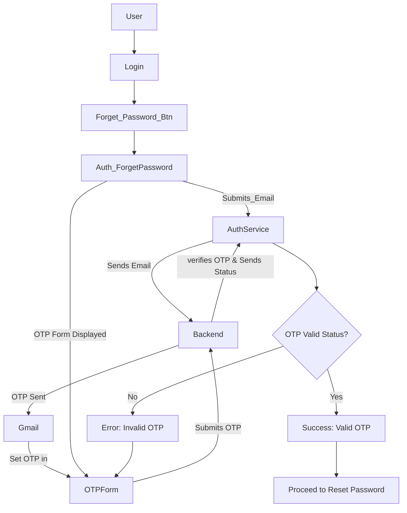

# OscuroBok Frontend Codebase

Welcome to the OscuroBok Frontend Codebase! This README provides a comprehensive yet simple guide for new contributors to understand the key components and flow of this Next.js project. The codebase primarily focuses on user authentication, OTP verification, and role-based access, using various modern technologies like React, Redux, MUI, Formik, and more.

## Tech Stack


- **Frontend**: Next.js, React, Redux
- **Styling**: Material-UI (MUI) components, custom styles
- **API Requests**: Axios (via services)
- **State Management**: Redux Toolkit
- **Form Handling**: Formik & Yup (for validation)
- **Authentication**: OTP-based (Simulated)

---

## Key Features

### Email-to-OTP Workflow
- Users enter their email, triggering an OTP form. The OTP is verified against the backend to initiate a password reset.

### Role-Based Routing
- Based on the user type (Admin/User), redirection occurs after login using a single API call.

### Smooth Transitions
- Components like email and OTP forms have smooth UI transitions for better user experience.

### Form Validation & Feedback
- Uses Formik to handle form state, and validation provides real-time feedback. Alerts are shown using `react-toastify`.

### Forget Password Workflow




    
## State Management
- The Redux store manages global authentication and user data. Key actions include login, verifyOtp, and fetchUserData

### Project Flow


## Documentations

- [MUI]:- https://mui.com/material-ui/getting-started/
- [NextJS App router]:- https://nextjs.org/docs/app
- Check [FAQ Page](https://www.creative-tim.com/faq)


## Versions
OscuroBok 1.0

## Pages

- [Dashboard page](https://demos.creative-tim.com/material-tailwind-dashboard-react/#/dashboard/home?ref=readme-mtdr)
- [Profile page](https://demos.creative-tim.com/material-tailwind-dashboard-react/#/dashboard/profile?ref=readme-mtdr)
- [Sign in page](https://demos.creative-tim.com/material-tailwind-dashboard-react/#/auth/sign-in?ref=readme-mtdr)
- [Sign up page](https://demos.creative-tim.com/material-tailwind-dashboard-react/#/auth/sign-up?ref=readme-mtdr)
- [Forget Password page](https://demos.creative-tim.com/material-tailwind-dashboard-react/#/auth/sign-up?ref=readme-mtdr)

## Components

 AuthForgotPassword
- Located in app/auth/forgot-password/page.tsx
- Handles email input and OTP verification using the useFormik hook for state management.

## Deploy

:rocket: You can deploy your own version of the template to Genezio with one click:

[](https://app.genez.io/start/deploy?repository=https://github.com/creativetimofficial/material-tailwind-dashboard-react&utm_source=github&utm_medium=referral&utm_campaign=github-creativetim&utm_term=deploy-project&utm_content=button-head)

## Terminal Commands

1. Download and Install NodeJs LTS version from [NodeJs Official Page](https://nodejs.org/en/download/).
2. Navigate to the root ./ directory of the product and run `npm install` or `yarn install` or `pnpm install` to install our local dependencies.
   
    ### OscuroBok_Dashboard_FE
        * git init
        * git clone https://github.com/OscuroBok/OscuroBok_dashboard.git(Clone from master)
        * git clone -b dashboard-sign-in https://github.com/OscuroBok/OscuroBok_dashboard_FE.git((Clone from specific branch)
        * git add --all
        * git commit -m "Some mesage"
        * git push or git push --set-upstream origin master
        * Navigate to the root ./ directory of the project and run `npm i` or `yarn install` (Install dependencies in package.json)
        * npm run dev(Start application)

### Folder Structure

```
📦 src/
├── 📂 app/
│   ├── 📂 components/
│   │   ├── 📂 auth/                   # Auth-related components like login, registration, password reset
│   │   │   ├── AuthLogin.tsx
│   │   │   ├── AuthRegister.tsx
│   │   │   └── AuthResetPassword.tsx
│   │   ├── 📂 container/
│   │   │   ├── 📂 custom-scroll/      # Custom scroll bar component
│   │   │   ├── 📂 dashboards/         # Dashboard UI components
│   │   │   ├── 📂 forms/              # Form elements and components
│   │   │   └── 📂 shared/             # Reusable shared components
│   ├── 📄 app.tsx                     # Main application component
│   ├── 📄 global.css                  # Global styling
│   ├── 📄 layout.tsx                  # Layout structure of the application
│   ├── 📄 loading.tsx                 # Loading state component
│   └── 📄 not-found.tsx               # 404 Page component
├── 📂 hooks/                          # Custom hooks used across the app, Inbuilt React hooks like useState, etc.
│   ├── useAuth.ts
│   ├── useLogout.ts
│   ├── usePermission.ts
│   ├── useProfile.ts
│   ├── useRouteInitializer.ts
│   └── useUnAuth.ts
├── 📂 services/                       # API service handlers for business logic
│   ├── 📂 configs/
│   │   └── axiosConfigs.ts            # Axios configuration for API requests
│   ├── authService.ts                 # Service for authentication
│   ├── dashboardService.ts            # Service for handling dashboard data
│   ├── moduleService.ts               # Service for different modules
│   ├── profileService.ts              # Service for user profile management
│   ├── roleService.ts                 # Service for managing roles and permissions
│   └── userService.ts                 # Service for user-related API calls
├── 📂 store/                          # Redux store for state management
│   ├── 📂 auth/
│   ├── hooks.ts                       # Hooks for interacting with Redux store
│   ├── providers.tsx                  # Providers for Redux and other global state
│   └── store.ts                       # Main Redux store configuration
├── 📂 types/                          # TypeScript types for type checking
├── 📂 utils/                          # Utility functions and helpers
│   ├── 📂 helper/
│   ├── 📂 languages/
│   └── 📂 theme/
│       ├── axios.js                   # Axios utility functions
│       ├── i18n.ts                    # Internationalization setup
├── 📄 .env                            # Environment variables
├── 📄 .eslintrc.json                  # ESLint configuration for code linting
├── 📄 .gitignore                      # Files and directories to be ignored by Git
└── 📄 LICENSE                         # License information for the project

```

## Browser Support

At present, we officially aim to support the last two versions of the following browsers:

    

## Licensing

- Copyright 2024 [OscuroBok](https://github.com/OscuroBok/OscuroBok_dashboard_FE/blob/master/LICENSE)

## Useful Links

- [More products](https://www.creative-tim.com/templates?ref=readme-mtdr) 

##### Social Media

Twitter: <>

Facebook: <https://www.facebook.com/CreativeTim>

Google+: <>

Instagram: <https://www.instagram.com/lesorcoscuro8>

Gmail: <lesorc4202@gmail.com>

LinkedIn: <https://www.linkedin.com/company/lesorc>


git init

git remote add origin https://github.com/OscuroBok/Oscuro_Next_Dashboard.git -> Add your GitHub repository as a remote

git commit -m "Your commit message"

git add . -> You need to stage the files that you want to commit.

git push -u origin master -> Push the changes to your GitHub repository

This is a [Next.js](https://nextjs.org/) project bootstrapped with [`create-next-app`](https://github.com/vercel/next.js/tree/canary/packages/create-next-app).

## Getting Started

First, run the development server:

```bash
npm run dev
# or
yarn dev
# or
pnpm dev
```

Open [http://localhost:3000](http://localhost:3000) with your browser to see the result.

You can start editing the page by modifying `app/page.tsx`. The page auto-updates as you edit the file.

This project uses [`next/font`](https://nextjs.org/docs/basic-features/font-optimization) to automatically optimize and load Inter, a custom Google Font.


## Deploy on Vercel

The easiest way to deploy your Next.js app is to use the [Vercel Platform](https://vercel.com/new?utm_medium=default-template&filter=next.js&utm_source=create-next-app&utm_campaign=create-next-app-readme) from the creators of Next.js.

Check out our [Next.js deployment documentation](https://nextjs.org/docs/deployment) for more details.
