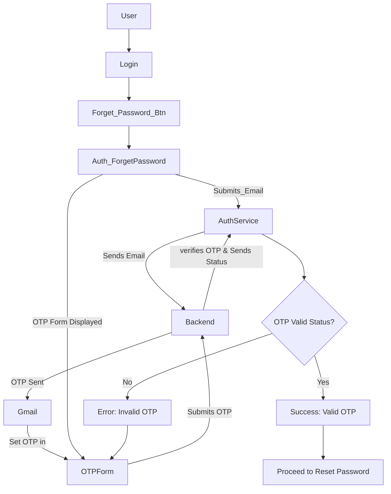

### Forget Password Workflow

```mermaid

graph TD
    %% 1: User submits email to begin the reset process
    A[User] --> Login
 Login --> B[Forget_Password_Btn]
    %% 2: Button triggers Forget Password auth
    B[Forget_Password_Btn] --> C[Auth_ForgetPassword]
    %% 3: Email submitted to AuthService
    C[Auth_ForgetPassword] --> |Submits_Email| AuthService
    %% 4: AuthService calls Backend to send email
    AuthService --> |Sends Email| Backend
    %% 5: Move to next step (Proceed to Reset)
    %% 6: Backend sends OTP via Gmail
    Backend --> |OTP Sent| Gmail
    %% 7: OTP received and set in OTP form
    Gmail --> |Set OTP in| OTPForm
    
    %% 8: OTP Form is displayed to the user
    C[Auth_ForgetPassword] --> |OTP Form Displayed| OTPForm
    %% 9: User submits OTP for validation
    OTPForm --> |Submits OTP| Backend
    %% 10: Backend checks OTP validity
    Backend --> |verifies OTP & Sends Status| AuthService
    
    %% 11: If valid, proceed to success
    AuthService --> E{OTP Valid Status?}
    E -->|Yes| F[Success: Valid OTP]
    %% 12: If invalid, show error
    E -->|No| G[Error: Invalid OTP]

    %% 13: Success, proceed to reset
    F[Success: Valid OTP] --> H[Proceed to Reset Password]
    %% 14: Failure, return to OTP form for retry
    G[Error: Invalid OTP] --> OTPForm

```